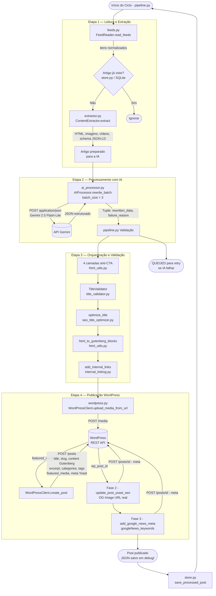

# ARCHITECTURE_PIPELINE_AS_IS.md

> **Documento:** Arquitetura Atual da Automação do Portal Máquina Nerd  
> **Status:** AS-IS (estado real do código em produção)  
> **Atualizado em:** Março de 2026  
> **Baseado em:** código-fonte do repositório `maquinanerd/TheNerdMN`, branch `main`

---

## Índice

1. [Visão Geral da Arquitetura](#1-visão-geral-da-arquitetura)
2. [Etapa 1 — Leitura e Extração](#2-etapa-1--leitura-e-extração)
3. [Etapa 2 — Processamento com IA](#3-etapa-2--processamento-com-ia-ai_processorpy)
4. [Etapa 3 — A Estrutura do JSON Esperado](#4-etapa-3--a-estrutura-do-json-esperado)
5. [Etapa 4 — Orquestração e Validação](#5-etapa-4--orquestração-e-validação-pipelinepy)
6. [Etapa 5 — Publicação no WordPress](#6-etapa-5--publicação-no-wordpress-wordpresspy)
7. [Camada de Persistência](#7-camada-de-persistência-storepy--storedb)
8. [Configuração e Variáveis de Ambiente](#8-configuração-e-variáveis-de-ambiente-configpy)
9. [Estrutura de Módulos](#9-estrutura-de-módulos)

---

## 1. Visão Geral da Arquitetura

O sistema é um **pipeline Python em modo batch**, executado como um processo contínuo (`pipeline.py`) que orquestra 5 responsabilidades principais de forma sequencial:

```
Feeds RSS/Sitemap → Extração de Conteúdo → Reescrita por IA → Validação → Publicação no WordPress
```

Cada ciclo do pipeline:
1. Lê os feeds configurados em `RSS_FEEDS` (atualmente focado em ScreenRant)
2. Filtra artigos já vistos (via banco SQLite `data/app.db`)
3. Faz scraping do HTML original das matérias-fonte
4. Envia lotes de até 3 artigos por chamada ao Gemini (economia de quota)
5. Valida e limpa o conteúdo retornado
6. Publica no WordPress e aplica metadados Yoast SEO

### Diagrama de Fluxo (Mermaid)



---

## 2. Etapa 1 — Leitura e Extração

### 2.1 `feeds.py` — FeedReader

O módulo suporta dois formatos de fonte: **RSS/Atom** (via `feedparser`) e **Sitemap XML** (via `xml.etree.ElementTree`).

**Feeds atualmente configurados** (`app/config.py → RSS_FEEDS`):

| source_id | URL | Categoria |
|-----------|-----|-----------|
| `screenrant_movie_lists` | `https://screenrant.com/feed/movie-lists/` | movies |
| `screenrant_movie_news` | `https://screenrant.com/feed/movie-news/` | movies |
| `screenrant_tv` | `https://screenrant.com/feed/tv/` | tv |

**Comportamento do `FeedReader.read_feeds()`:**

1. Itera sobre a lista de `urls` da config do feed
2. Faz `GET` com `User-Agent` de navegador Chrome para evitar bloqueios
3. Se `Content-Type: gzip`, descomprime automaticamente
4. Para feeds RSS: usa `feedparser.parse()`. Se o feed for malformado (`bozo=True`), tenta uma segunda leitura com `sanitize_html=False`
5. Para sitemaps: parse recursivo — detecta `sitemapindex` e faz fetch dos sitemaps-filhos
6. Aplica `deny_regex` (filtro por URL/título, configurável por feed) para excluir artigos indesejados
7. Normaliza todos os itens para a estrutura canônica via `normalize_item()`:

```python
{
    "id":        "sha256-do-guid-ou-link",  # ID estável
    "url":       "https://fonte.com/artigo",
    "title":     "Título original do artigo",
    "published": "2026-01-15T14:30:00+00:00",  # ISO 8601
    "author":    "Nome do autor (se disponível)",
    "summary":   "Resumo do feed (se disponível)",
    "_raw":      { ... }  # dados brutos do feedparser
}
```

8. Deduplicação por URL antes de retornar

### 2.2 `extractor.py` — ContentExtractor

Faz scraping completo da página original para obter o HTML editorial limpado.

**Pipeline de extração:**

```
GET página → BeautifulSoup → _find_article_body() → collect_images() + extract_videos() → JSON-LD schema
```

**Localização do corpo do artigo** (`_find_article_body()`):

| Prioridade | Seletor |
|-----------|---------|
| 1º | `<article>` nativo |
| 2º | `article .entry-content`, `[itemprop='articleBody']`, `.post-content`, `.article-body` |
| 3º | Nó com maior contagem de `<p>` + `<figure>` (heurística) |

Nós com classes/IDs que casam com o padrão `related|trending|sidebar|newsletter|subscribe|ad|taboola|outbrain` são **excluídos**.

**Extração de imagens** (`collect_images_from_article()`):

Fontes verificadas em sequência:
1. ``, `data-src`, `data-original`, `data-lazy-src`
2. `<picture><source srcset>`
3. `<noscript>` com `` (fallback lazy-load)
4. Atributos `data-img-url`, `data-image`
5. `style="background-image: url(...)"` inline
6. `<figure>` com ``

**Filtros de rejeição de imagem** (`is_valid_article_image()`):

- Domínios bloqueados: `gravatar.com`, `twimg.com`, `doubleclick.net`, `scorecardresearch.com`, etc.
- Palavras-chave na URL: `author`, `avatar`, `logo`, `placeholder`, `icon`, `favicon`
- Dimensões explícitas na URL abaixo de 600×315 px
- Razão de aspecto fora do intervalo `0.6 – 2.2`

**Extração de vídeos:** detecta URLs do YouTube (`youtube.com`, `youtu.be`, `m.youtube.com`) e converte para URL de embed (`/embed/{video_id}`).

**Extração de Schema JSON-LD:** localiza `<script type="application/ld+json">` e retorna o objeto `schema_original` intacto para envio à IA.

---

## 3. Etapa 2 — Processamento com IA (`ai_processor.py`)

### 3.1 Inicialização e pool de chaves

O `AIProcessor` lê múltiplas chaves `GEMINI_*` do ambiente (todas iniciando com `AIza`), organiza em lista ordenada por nome e implementa **rodízio automático** entre elas para distribuir quota.

### 3.2 Montagem do prompt

O prompt final enviado ao Gemini é a concatenação de:

```
AI_SYSTEM_RULES   (definido diretamente em ai_processor.py — regras obrigatórias)
+
universal_prompt.txt  (carregado de disco — template com instruções editoriais detalhadas)
```

Campos injetados no template via `_safe_format_prompt()` (substituição segura, sem `KeyError`):

| Placeholder | Origem |
|-------------|--------|
| `{titulo_original}` | título do item no feed |
| `{url_original}` | URL da matéria-fonte |
| `{content}` | HTML extraído pelo `extractor.py` |
| `{domain}` | domínio do portal (ex: `maquinanerd.com.br`) |
| `{fonte_nome}` | hostname da fonte (ex: `screenrant.com`) |
| `{categoria}` | categoria configurada no feed |
| `{schema_original}` | JSON-LD extraído da página fonte |
| `{videos_list}` | URLs de embed YouTube encontrados |
| `{imagens_list}` | URLs de imagens válidas extraídas |

### 3.3 Configuração da chamada à API

```python
generation_config = {
    "response_mime_type": "application/json",  # Força JSON puro, sem texto extra
    "temperature": 0.2,                         # Saída determinística
    "top_p": 0.9,
    "max_output_tokens": 32000,                 # 32K para garantir resposta completa em batch
}
```

> **Ponto crítico:** `response_mime_type: "application/json"` instrui o modelo a produzir **exclusivamente** um objeto JSON válido, eliminando texto explicativo ou markdown extra que quebraria o parsing.

### 3.4 Processamento em lote

O pipeline agrupa até **3 artigos por chamada** (`batch_size = 3`). O prompt soma os artigos com separadores:

```
=== ARTIGO 1 ===
[template preenchido com dados do artigo 1]

=== ARTIGO 2 ===
[template preenchido com dados do artigo 2]
```

O `AI_SYSTEM_RULES` instrui o modelo a retornar um objeto com array `resultados`, preservando a ordem dos artigos de entrada.

### 3.5 Regras fixas do `AI_SYSTEM_RULES`

As seguintes regras estão **hardcoded** no código Python (não editáveis sem deploy):

#### Regras de título (`titulo_final`)
- Entre **55 e 65 caracteres**
- Iniciar com **entidade** (ator, franquia, plataforma)
- **Verbo no presente** (nunca infinitivo)
- **Afirmação direta**, nunca pergunta
- Maiúsculas apenas em nomes próprios
- Sem sensacionalismo: `"bomba"`, `"explode"`, `"nerfado"`, `"surpreendente"` são proibidos
- Plataforma no final quando relevante
- Sem múltiplos dois-pontos

#### Regra crítica anti-CTA
É **terminantemente proibido** incluir no `conteudo_final`:

| Categoria | Exemplos proibidos |
|-----------|-------------------|
| Thank you | "Thank you for reading", "Thanks for reading", "Thanks for visiting" |
| Subscribe | "Don't forget to subscribe", "Please subscribe", "Subscribe now" |
| CTAs de ação | "Click here", "Read more", "Sign up", "Clique aqui", "Leia mais" |
| Social | "Stay tuned", "Follow us", "Fique atento", "Nos siga" |
| Encerramento | "This article was...", "If you enjoyed this...", "Obrigado por ler" |

#### Proibição de concorrentes
Nomes de portais concorrentes são **completamente proibidos** no output:
- `Omelete`, `Jovem Nerd`, `IGN`, `IGN Brasil`, `AdoroCinema`
- Estratégia: reescrever a frase de forma neutra, atribuindo à empresa/estúdio em vez do portal

#### Requisitos do `conteudo_final`
- Mínimo **3 subtítulos `<h2>`**
- Palavra-chave no **primeiro parágrafo**
- Imagens dentro de `<figure>` com `<figcaption>`
- Links internos **obrigatoriamente absolutos**: `<a href="https://{domain}/tag/{tag}">Texto</a>`
- Máximo **4 links internos** por artigo
- Parágrafos com no máximo **3 a 4 frases**

#### Meta description
- **140 a 155 caracteres**
- Contém a palavra-chave principal
- Sem call-to-action

---

## 4. Etapa 3 — A Estrutura do JSON Esperado

O Gemini devolve um objeto JSON com o array `resultados`. Cada elemento do array representa um artigo e deve conter obrigatoriamente os seguintes campos:

```jsonc
{
  "resultados": [
    {
      // ─── CONTEÚDO EDITORIAL ─────────────────────────────────────────────

      "titulo_final": "Marvel revela data de estreia de Vingadores 5 no Disney+",
      // String · Máx 65 chars · Verbo presente · Começa com entidade

      "conteudo_final": "<p>A <b>Marvel Studios</b> confirmou...</p><h2>O que esperar...</h2>...",
      // HTML · Mínimo 3 <h2> · Parágrafos curtos · Imagens em <figure><figcaption>
      // Links internos absolutos: <a href="https://maquinanerd.com.br/tag/marvel">Marvel</a>

      "meta_description": "Marvel Studios confirma data de estreia de Vingadores 5 no Disney+ para 2027. Filme encerra a Saga do Multiverso.",
      // String · 140–155 chars · Contém focus_keyphrase · Sem CTA

      // ─── SEO ESTRUTURAL ──────────────────────────────────────────────────

      "focus_keyphrase": "Vingadores 5 Marvel",
      // String · Máx 60 chars · Frase curta e natural

      "related_keyphrases": [
        "Vingadores Saga do Multiverso",
        "Marvel Fase 6",
        "Avengers 5 Disney Plus"
      ],
      // Array de strings · 2 a 5 variações semânticas da focus_keyphrase

      "slug": "vingadores-5-marvel-data-estreia",
      // String · Máx 5 palavras · URL-friendly

      // ─── TAXONOMIA ───────────────────────────────────────────────────────

      "categorias": [
        { "nome": "Marvel",   "grupo": "franquias",  "evidence": "Marvel Studios" },
        { "nome": "Disney+",  "grupo": "editorias",  "evidence": "Disney+" }
      ],
      // Array de objetos · Máx 3 categorias · Evidência = trecho literal do texto

      "tags_sugeridas": [
        "Vingadores", "Marvel", "Disney+", "Saga do Multiverso", "MCU"
      ],
      // Array de strings · 5 a 7 tags · Nomes de atores, franquias, eventos

      // ─── ALT TEXTS (OPCIONAL) ────────────────────────────────────────────

      "image_alt_texts": {
        "vingadores-5-poster.jpg": "Poster oficial de Vingadores 5 da Marvel Studios"
      },
      // Dict: nome-do-arquivo → alt text com palavra-chave

      // ─── YOAST META ──────────────────────────────────────────────────────

      "yoast_meta": {
        "_yoast_wpseo_title":                  "Vingadores 5 tem data de estreia confirmada pela Marvel",
        "_yoast_wpseo_metadesc":               "Marvel Studios confirma data de estreia de Vingadores 5 no Disney+ para 2027. Filme encerra a Saga do Multiverso.",
        "_yoast_wpseo_focuskw":                "Vingadores 5 Marvel",
        "_yoast_news_keywords":                "Vingadores, Marvel, Disney+, Saga do Multiverso, MCU, Fase 6",
        "_yoast_wpseo_opengraph-title":        "Vingadores 5: Marvel revela data de estreia no Disney+",
        "_yoast_wpseo_opengraph-description":  "A Marvel Studios confirmou a data de estreia de Vingadores 5 na plataforma Disney+, encerrando a Saga do Multiverso.",
        "_yoast_wpseo_twitter-title":          "Vingadores 5: data de estreia confirmada pela Marvel",
        "_yoast_wpseo_twitter-description":    "Marvel revela a data de estreia de Vingadores 5. Filme encerra a Saga do Multiverso."
      }
    }
  ]
}
```

### Campos obrigatórios vs. opcionais

| Campo | Obrigatoriedade | Usado por |
|-------|----------------|-----------|
| `titulo_final` | **Obrigatório** | WordPress title |
| `conteudo_final` | **Obrigatório** | WordPress content (Gutenberg) |
| `meta_description` | **Obrigatório** | WordPress excerpt + Yoast |
| `focus_keyphrase` | **Obrigatório** | Yoast focuskw |
| `related_keyphrases` | **Obrigatório** | `_yoast_wpseo_keyphrases` |
| `slug` | **Obrigatório** | WordPress slug |
| `categorias` | **Obrigatório** | WordPress categories |
| `tags_sugeridas` | **Obrigatório** | WordPress tags |
| `yoast_meta` | **Obrigatório** | Meta fields do Yoast SEO |
| `image_alt_texts` | Opcional | Alt text nas imagens |

---

## 5. Etapa 4 — Orquestração e Validação (`pipeline.py`)

### 5.1 Fluxo geral após recebimento do JSON da IA

```
rewritten_data (dict)
    │
    ├── 1. Extração de campos           (titulo_final, conteudo_final)
    ├── 2. Limpeza anti-CTA (4 camadas) (html_utils.py)
    ├── 3. Validação de título          (title_validator.py)
    ├── 4. Otimização de título         (seo_title_optimizer.py)
    ├── 5. Processamento de HTML        (html_utils.py)
    ├── 6. Upload de imagem             (wordpress.py)
    ├── 7. Resolução de categorias      (wordpress.py)
    ├── 8. Links internos               (internal_linking.py)
    ├── 9. Conversão Gutenberg          (html_utils.py)
    └── 10. Publicação                  (wordpress.py)
```

### 5.2 As 4 camadas de limpeza anti-CTA

O sistema aplica limpeza em cascata, do mais específico ao mais genérico:

**Camada 0 — Pré-limpeza estrutural** (`strip_forbidden_cta_sentences()` em `html_utils.py`):
- Usa BeautifulSoup para encontrar tags `<p>`, `<div>`, `<span>`, `<section>`, `<li>`, etc.
- Para cada nó, extrai o texto, normaliza (remove acentos, pontuação, lowercase) e compara com regras de CTA
- Remove o nó DOM inteiro se detectado

**Camada 1 — Busca literal exata** (pipeline.py):
```python
nuclear_phrases = [
    "Thank you for reading this post, don't forget to subscribe!",
    "thank you for reading this post, don't forget to subscribe!",
    # variações...
]
content_html = content_html.replace(phrase, "")
```

**Camada 1.5 — Regex flexível de sentença** (pipeline.py):
```python
r"(?is)(?:<p[^>]*>\s*)?(?:<[^>]+>\s*)*thank\s+you\s+for\s+reading(?:\s|&nbsp;|<[^>]+>)*?don['']t\s+forget\s+to\s+subscribe(?:\s|&nbsp;|<[^>]+>)*?(?:</p>)?"
```
Cobre variações com formatação inline, apóstrofos diferentes (`'` vs `'`), espaços HTML (`&nbsp;`).

**Camada 2 — Remoção de parágrafos completos** (pipeline.py):
Lista de 27 regex que removem `<p>` inteiros contendo padrões como `subscribe`, `click here`, `follow us`, `obrigado por ler`, etc.

**Camada 3 — Limpeza de tags vazias:**
```python
re.sub(r'<(p|div|span|article)[^>]*>\s*</\1>', '', content_html)
re.sub(r'<p[^>]*>\s*<br[^>]*>\s*</p>',         '', content_html)
```

**Camada 4 — Verificação final e bloqueio** (gatekeeping antes de publicar):
```python
if 'thank you for reading' in content_html.lower():
    db.update_article_status(art_data['db_id'], 'FAILED', reason="CTA persisted")
    continue  # Artigo BLOQUEADO — não vai ao WordPress
```

> Se detectado na **verificação final**, o artigo recebe status `FAILED` e não é publicado.

### 5.3 Validação de título (`TitleValidator` + `optimize_title`)

**`TitleValidator.validate(title)`** retorna um dict com `status: OK | AVISO | ERRO` e lista de erros. Os erros são corrigidos automaticamente quando possível:

| Erro detectado | Estratégia automática |
|----------------|----------------------|
| Título muito longo (> 65 chars) | Tenta cortar em separadores `": "`, `" - "`, `" – "`. Se falhar, corta em palavra + `"…"` |
| Título muito curto | Tenta `suggest_correction()` para expandir |
| Erro não corrigível | Eleva para `AVISO`, loga e **prossegue** (não bloqueia publicação) |

**`optimize_title(title, content_html)`** aplica otimizações para Google News e Discovery:
- Remove redundâncias
- Verifica presença de palavra-chave
- Gera relatório com `original_score` e `optimized_score`

### 5.4 Processamento do HTML do conteúdo

Em sequência, antes de enviar ao WordPress:

```python
content_html = unescape_html_content(content_html)        # Decocifica &amp; &lt; etc.
content_html = validate_and_fix_figures(content_html)     # Repara <figure> quebradas
content_html = remove_broken_image_placeholders(content_html)
content_html = strip_naked_internal_links(content_html)   # Remove links soltos sem âncora
content_html = merge_images_into_content(content_html, images)  # Intercala imagens no texto
content_html = strip_credits_and_normalize_youtube(content_html)
content_html = remove_source_domain_schemas(content_html) # Remove JSON-LD da fonte (conflito SEO)
```

### 5.5 Conversão para Blocos Gutenberg

O HTML resultante é convertido para o formato nativo do editor WordPress:

```python
gutenberg_content = html_to_gutenberg_blocks(content_html)
```

Resultado exemplo:

```
<!-- wp:paragraph -->
<p>A <b>Marvel Studios</b> confirmou a data de estreia...</p>
<!-- /wp:paragraph -->

<!-- wp:heading {"level":2} -->
<h2>O que esperar de Vingadores 5</h2>
<!-- /wp:heading -->
```

### 5.6 Resolução de categorias

```python
# 1. Categoria padrão sempre incluída
final_category_ids = {WORDPRESS_CATEGORIES['Notícias']}  # ID 20

# 2. Categorias fixas por source_id (config.py → SOURCE_CATEGORY_MAP)
# Ex: screenrant_movie_news → ['Filmes'] → ID 24

# 3. Categorias dinâmicas sugeridas pela IA
# AI retorna [{ "nome": "Marvel", "grupo": "franquias" }]
# Pipeline chama wp_client.resolve_category_names_to_ids(['Marvel'])
# → GET /categories?search=Marvel → se não existir → POST /categories
```

### 5.7 Links internos (`internal_linking.py`)

O `add_internal_links()` opera com um `link_map` carregado do banco de dados, que mapeia **termos** para URLs de posts já publicados no site. Ele insere links internos no HTML priorizando artigos definidos como `PILAR_POSTS` na configuração.

---

## 6. Etapa 5 — Publicação no WordPress (`wordpress.py`)

### 6.1 Fase 0 — Upload da imagem para a Media Library

```
GET  {featured_image_url}           → baixa bytes da imagem (timeout: 25s)
POST /wp-json/wp/v2/media           → upload com headers Content-Disposition + Content-Type
     → retorna { "id": 9834, "source_url": "https://maquinanerd.com.br/wp-content/..." }
POST /wp-json/wp/v2/media/9834      → atualiza alt_text = título do artigo
```

- **Retry automático** em `Timeout` ou `ConnectionError`: até 3 tentativas com backoff `2 × attempt` segundos
- Imagens com domínio inválido, dimensão ≤ 100px ou sem extensão conhecida (`.jpg`, `.jpeg`, `.png`, `.webp`, `.gif`) são rejeitadas antes do upload

### 6.2 Fase 1 — Criação do post (`create_post`)

**Campos enviados** via `POST /wp-json/wp/v2/posts`:

```json
{
  "title":          "Marvel revela data de estreia de Vingadores 5 no Disney+",
  "slug":           "vingadores-5-marvel-data-estreia",
  "content":        "<!-- wp:paragraph --><p>A Marvel Studios...</p><!-- /wp:paragraph -->...",
  "excerpt":        "Marvel Studios confirma data de estreia de Vingadores 5 no Disney+...",
  "categories":     [20, 24],
  "tags":           [101, 205, 310],
  "featured_media": 9834,
  "status":         "publish",
  "meta": {
    "_yoast_wpseo_title":     "Vingadores 5 tem data de estreia confirmada pela Marvel",
    "_yoast_wpseo_metadesc":  "Marvel Studios confirma data de estreia de Vingadores 5...",
    "_yoast_wpseo_focuskw":   "Vingadores 5 Marvel",
    "_yoast_wpseo_canonical": "https://screenrant.com/artigo-original",
    "_yoast_wpseo_keyphrases": "[{\"keyword\":\"Vingadores Saga do Multiverso\"}, ...]"
  }
}
```

> **`_yoast_wpseo_canonical`** aponta para a **URL da fonte original**, sinalizando ao Google que o conteúdo é derivado e evitando penalização por duplicate content.

**Filtro de segurança pré-envio** — somente estes campos chegam ao WordPress:

```python
safe_fields = ['title', 'slug', 'content', 'excerpt', 'categories', 'tags',
               'featured_media', 'status', 'meta']
clean_payload = {k: v for k, v in payload.items() if k in safe_fields}
```

**Validações antes do envio:**
- Conteúdo mínimo de 100 caracteres (rejeita se menor)
- Título mínimo de 3 caracteres
- Payload total ≤ 30 KB (tenta reduzir parágrafos curtos antes de rejeitar)
- Caracteres Unicode problemáticos substituídos (NBSP, espaço en/em, zero-width space)

**Resolução de tags** — o método `_ensure_tag_ids()` converte nomes para IDs:
1. Se o valor já é int → usa direto
2. Busca por `GET /tags?search={nome}` comparando nome exato e slug
3. Se não existir → `POST /tags {name, slug}`
4. Race condition protegida: se retornar `term_exists (400)`, re-busca o ID

### 6.3 Fase 2 — Atualização do Yoast SEO (`update_post_yoast_seo`)

Depois de receber o `wp_post_id`, o pipeline faz um `POST /posts/{id}` com metadados específicos do Yoast que dependem de dados só disponíveis após a criação do post:

```json
{
  "meta": {
    "_yoast_wpseo_title":              "Vingadores 5 tem data confirmada pela Marvel",
    "_yoast_wpseo_metadesc":           "Marvel Studios confirma data para 2027...",
    "_yoast_wpseo_focuskw":            "Vingadores 5 Marvel",
    "_yoast_wpseo_opengraph-image":    "https://maquinanerd.com.br/wp-content/uploads/.../poster.jpg",
    "_yoast_wpseo_opengraph-image-id": "9834",
    "_yoast_wpseo_content_score":      "90"
  }
}
```

> **Por que duas fases?** O campo `_yoast_wpseo_opengraph-image` precisa da URL **real hospedada** no CDN do Maquina Nerd. Essa URL só existe após o upload da imagem. O sistema busca `GET /media/9834` para obter o `source_url` e só então popula o campo OG.

Se esta fase falhar, o pipeline **não cancela o post** — loga `⚠️ Falha ao atualizar Yoast SEO` e continua.

### 6.4 Fase 3 — Google News Meta (`add_google_news_meta`)

```json
{
  "meta": {
    "googleNews_keywords": "Vingadores, Marvel, Disney+, MCU, Fase 6",
    "googleNews_genres":   "Blog, News",
    "googleNews_standout": "no",
    "googleNews_access":   "Free"
  }
}
```

Esta fase é **não-crítica**: falha ignorada com log de debug.

### 6.5 Mapa completo: campo do JSON → campo WordPress/Yoast

| Campo no JSON da IA | Campo no WordPress | Onde aparece |
|--------------------|-------------------|--------------|
| `titulo_final` | `title` | Título do post (H1) |
| `conteudo_final` → Gutenberg | `content` | Corpo do artigo |
| `meta_description` | `excerpt` | Resumo nativo WP |
| `slug` | `slug` | URL amigável |
| `categorias[].nome` → IDs | `categories` | Taxonomia WP |
| `tags_sugeridas` → IDs | `tags` | Taxonomia WP |
| `yoast_meta._yoast_wpseo_title` | `meta._yoast_wpseo_title` | SEO title (Google, aba do navegador) |
| `yoast_meta._yoast_wpseo_metadesc` | `meta._yoast_wpseo_metadesc` | Meta description no Google |
| `yoast_meta._yoast_wpseo_focuskw` | `meta._yoast_wpseo_focuskw` | Focus keyphrase no painel Yoast |
| `yoast_meta._yoast_news_keywords` | `meta._yoast_news_keywords` | Yoast News SEO |
| `yoast_meta._yoast_wpseo_opengraph-title` | `meta._yoast_wpseo_opengraph-title` | Card Facebook/WhatsApp/LinkedIn |
| `yoast_meta._yoast_wpseo_opengraph-description` | `meta._yoast_wpseo_opengraph-description` | Card Facebook/WhatsApp/LinkedIn |
| `yoast_meta._yoast_wpseo_twitter-title` | `meta._yoast_wpseo_twitter-title` | Card Twitter/X |
| `yoast_meta._yoast_wpseo_twitter-description` | `meta._yoast_wpseo_twitter-description` | Card Twitter/X |
| `related_keyphrases` | `meta._yoast_wpseo_keyphrases` (JSON array) | Related Keyphrases no Yoast |
| URL original da fonte | `meta._yoast_wpseo_canonical` | Tag `<link rel="canonical">` |
| ID da imagem upada | `meta._yoast_wpseo_opengraph-image-id` | OG image ID internal |
| URL real da imagem (busca dinâmica) | `meta._yoast_wpseo_opengraph-image` | OG image URL para redes sociais |

---

## 7. Camada de Persistência (`store.py` + `data/app.db`)

Banco SQLite armazenado em `data/app.db`. Gerencia o ciclo de vida de cada artigo detectado.

**Estados possíveis de um artigo:**

```
QUEUED ──► (processamento) ──► PUBLISHED
              │
              ├──► FAILED          (erro permanente — não será reprocessado)
              └──► QUEUED (retry)  (falha recuperável — IA sem quota, etc.)
```

**Operações principais:**

| Método | Quando é chamado |
|--------|-----------------|
| `is_seen(url)` | Antes do scraping — evita reprocessar artigos já vistos |
| `save_queued_article(...)` | Quando um artigo novo é detectado no feed |
| `get_queued_articles(limit)` | Pipeline busca o próximo lote para processar |
| `update_article_status(id, status)` | Atualiza estado após cada etapa |
| `save_processed_post(db_id, wp_post_id)` | Registra o ID do post criado no WP |

---

## 8. Configuração e Variáveis de Ambiente (`config.py`)

Todas as configurações sensíveis são lidas via variáveis de ambiente (arquivo `.env` na raiz):

| Variável | Exemplo | Descrição |
|----------|---------|-----------|
| `GEMINI_KEY_1` | `AIzaXXXXXX...` | Chave primária Gemini |
| `GEMINI_KEY_2` | `AIzaYYYYYY...` | Chave secundária (rodízio) |
| `GEMINI_MODEL_ID` | `gemini-2.5-flash-lite` | Modelo em uso |
| `WORDPRESS_URL` | `https://maquinanerd.com.br/wp-json/wp/v2` | Endpoint da REST API |
| `WORDPRESS_USER` | `admin` | Usuário de autenticação |
| `WORDPRESS_PASSWORD` | `xxxx xxxx xxxx` | Application Password |
| `MAX_PER_FEED_CYCLE` | `3` | Máx artigos por feed por ciclo |
| `MAX_PER_CYCLE` | `10` | Máx artigos totais por ciclo |
| `ARTICLE_SLEEP_S` | `120` | Intervalo entre ciclos (segundos) |
| `BETWEEN_BATCH_DELAY_S` | `30` | Delay entre lotes de IA |
| `BETWEEN_PUBLISH_DELAY_S` | `30` | Delay entre publicações |
| `AI_MIN_INTERVAL_S` | `6` | Intervalo mínimo entre chamadas Gemini |

**IDs de categor ia WordPress pré-configurados** (`WORDPRESS_CATEGORIES`):

| Nome | ID |
|------|----|
| Notícias | 20 |
| Filmes | 24 |
| Séries | 21 |
| Games | 73 |

---

## 9. Estrutura de Módulos

```
app/
├── config.py           → Configuração centralizada, leitura de .env, RSS_FEEDS
├── pipeline.py         → Ponto de entrada e orquestrador principal
├── feeds.py            → FeedReader: leitura RSS/Atom/Sitemap
├── extractor.py        → ContentExtractor: scraping, imagens, vídeos, schema
├── ai_processor.py     → AIProcessor: chamada ao Gemini, parse do JSON, batch
├── ai_client_gemini.py → Wrapper HTTP da API Gemini, rodízio de chaves, backoff
├── wordpress.py        → WordPressClient: REST API, media, posts, Yoast, tags
├── store.py            → Database: SQLite, ciclo de vida dos artigos
├── html_utils.py       → Anti-CTA, Gutenberg converter, figure validator
├── internal_linking.py → Motor de links internos automáticos
├── title_validator.py  → Validação e correção de títulos segundo regras editoriais
├── seo_title_optimizer.py → Otimização de título para Google News/Discovery
├── cleaners.py         → Limpadores específicos por fonte (ex: globo.com)
├── token_tracker.py    → Contabilidade de tokens consumidos por chamada
└── logging_conf.py     → Configuração de logging estruturado
```

**Dependências externas principais:**

| Pacote | Uso |
|--------|-----|
| `feedparser` | Parsing de feeds RSS/Atom |
| `trafilatura` | Extração de texto limpo de páginas |
| `beautifulsoup4` + `lxml` | Parsing e manipulação de HTML |
| `requests` | HTTP client para feeds, imagens e WordPress REST API |
| `google-generativeai` | SDK do Gemini (ou chamada direta via HTTP no `ai_client_gemini.py`) |
| `python-slugify` | Geração de slugs URL-friendly |
| `python-dotenv` | Leitura do arquivo `.env` |
| `SQLAlchemy` / `sqlite3` | Persistência de artigos processados |

---

*Documento gerado com base no código real do repositório `maquinanerd/TheNerdMN`, branch `main`. Para atualizações, consulte diretamente os arquivos fonte referenciados em cada seção.*
